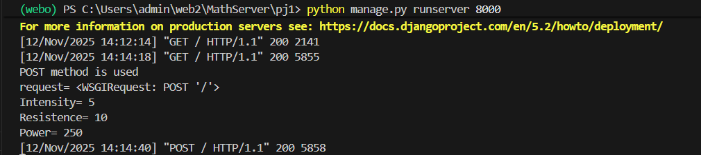
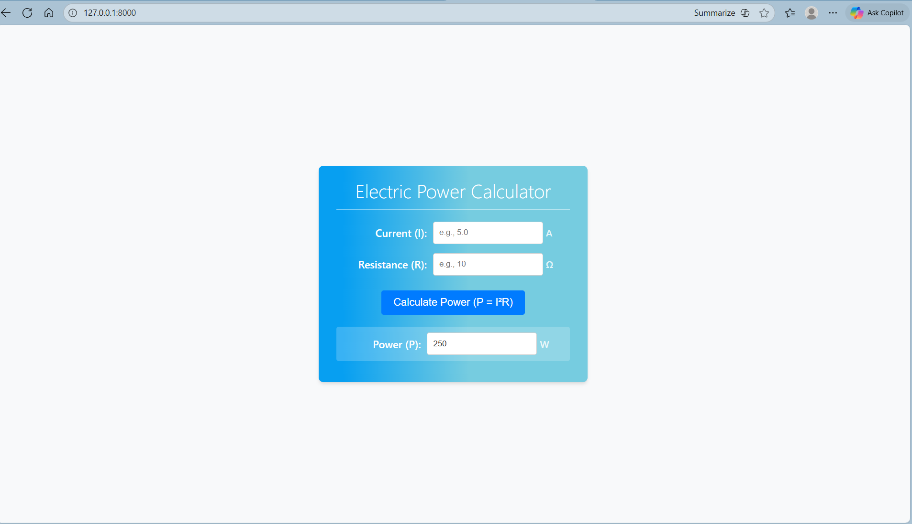

# Ex.05 Design a Website for Server Side Processing
## Date: 12.11.2025

## AIM:
 To design a website to calculate the power of a lamp filament in an incandescent bulb in the server side. 


## FORMULA:
P = I<sup>2</sup>R
<br> P --> Power (in watts)
<br> I --> Intensity
<br> R --> Resistance

## DESIGN STEPS:

### Step 1:
Clone the repository from GitHub.

### Step 2:
Create Django Admin project.

### Step 3:
Create a New App under the Django Admin project.

### Step 4:
Create python programs for views and urls to perform server side processing.

### Step 5:
Create a HTML file to implement form based input and output.

### Step 6:
Publish the website in the given URL.

## PROGRAM :

### Power.html
```
<!DOCTYPE html>
<html lang="en">
<head>
    <meta charset="UTF-8">
    <meta name="viewport" content="width=device-width, initial-scale=1.0">
    <meta http-equiv="X-UA-Compatible" content="ie=edge">
    <title>Electric Power Calculator | P = I²R</title>
    <style>
        /* --- General Reset & Typography --- */
        :root {
            --color-primary: #007bff; /* Blue */
            --color-secondary: #6c757d; /* Gray */
            --color-success: #28a745;
            --color-text: #333;
            --color-background-light: #f8f9fa; /* Light background */
            --color-card-background: #ffffff;
            --color-gradient-start: #079ff1;
            --color-gradient-end: #76cce0;
            --shadow-md: 0 4px 6px -1px rgba(0, 0, 0, 0.1), 0 2px 4px -2px rgba(0, 0, 0, 0.06);
            --border-radius: 8px;
        }

        body {
            font-family: 'Segoe UI', Tahoma, Geneva, Verdana, sans-serif;
            margin: 0;
            padding: 0;
            background-color: var(--color-background-light);
            color: var(--color-text);
            display: flex;
            justify-content: center;
            align-items: center;
            min-height: 100vh; /* Use min-height for better content handling */
        }

        /* --- Layout --- */
        .container {
            width: 100%;
            max-width: 450px; /* Standardize max width for forms/cards */
            padding: 20px;
        }

        /* --- Card/Box Styling --- */
        .calculator-card {
            background: var(--color-card-background);
            background-image: linear-gradient(90deg, var(--color-gradient-start) 9%, var(--color-gradient-end) 56%);
            border-radius: var(--border-radius);
            box-shadow: var(--shadow-md);
            padding: 20px 30px;
        }

        /* --- Heading --- */
        .calculator-card h1 {
            color: white;
            text-align: center;
            margin-top: 0;
            margin-bottom: 20px;
            font-size: 2em;
            font-weight: 300; /* Lighter weight for a modern look */
            border-bottom: 1px solid rgba(255, 255, 255, 0.5);
            padding-bottom: 10px;
        }

        /* --- Form Elements --- */
        .form-group {
            display: flex;
            justify-content: space-between;
            align-items: center;
            margin-bottom: 15px;
            color: white; /* Adjusted for the gradient background */
            font-size: 1.1em;
            font-weight: 500;
        }

        .form-group label {
            flex-basis: 45%; /* Give label space */
            text-align: right;
            padding-right: 10px;
        }

        .form-control {
            flex-basis: 55%; /* Give input space */
            display: flex;
            align-items: center;
        }
        
        input[type="text"] {
            padding: 10px;
            border-radius: 4px;
            border: 1px solid #ccc;
            flex-grow: 1; /* Input takes up available space */
            margin-right: 5px;
            min-width: 0; /* Prevents overflow issues */
            color: var(--color-text);
        }

        .unit {
            color: rgba(255, 255, 255, 0.8);
            font-size: 0.9em;
            width: 40px; /* Fixed width for unit */
            text-align: left;
        }

        /* --- Button Styling --- */
        .form-actions {
            text-align: center;
            margin-top: 25px;
            margin-bottom: 10px;
        }
        
        input[type="submit"] {
            background-color: var(--color-primary);
            color: white;
            padding: 10px 20px;
            border: none;
            border-radius: 4px;
            cursor: pointer;
            font-size: 1.1em;
            transition: background-color 0.3s ease;
        }

        input[type="submit"]:hover {
            background-color: #0056b3;
        }

        /* --- Result Styling --- */
        .result-group {
            background: rgba(255, 255, 255, 0.2); /* Light transparent background for contrast */
            padding: 10px;
            border-radius: 4px;
            margin-top: 20px;
        }
    </style>
</head>
<body>
    <div class="container">
        <div class="calculator-card">
            <h1>Electric Power Calculator</h1>
            
            <form method="POST">
                

                <div class="form-group">
                    <label for="id_intensity">Current (I):</label>
                    <div class="form-control">
                        <input type="text" id="id_intensity" name="Intensity" value="{{I|default:''}}" placeholder="e.g., 5.0" required>
                        <span class="unit">A</span>
                    </div>
                </div>

                <div class="form-group">
                    <label for="id_resistance">Resistance (R):</label>
                    <div class="form-control">
                        <input type="text" id="id_resistance" name="Resistence" value="{{R|default:''}}" placeholder="e.g., 10" required>
                        <span class="unit">Ω</span>
                    </div>
                </div>

                <div class="form-actions">
                    <input type="submit" value="Calculate Power (P = I²R)">
                </div>

                <div class="form-group result-group">
                    <label for="id_power">Power (P):</label>
                    <div class="form-control">
                        <input type="text" id="id_power" name="Power" value="{{Power|default:''}}" readonly>
                        <span class="unit">W</span>
                    </div>
                </div>
            </form>
        </div>
    </div>
</body>
</html>
```

### Urls.py :
```
from django.contrib import admin
from django.urls import path
from app1 import views
urlpatterns = [
    path('admin/', admin.site.urls),
    path('Power/',views.power,name="Power"),
    path('',views.power,name="Power"),]
```

### Views.py :
```
from django.shortcuts import render

def power(request):
    context={}
    context['Power'] = ""
    context['i'] = ""
    context['r'] = ""
    if request.method == 'POST':
        print("POST method is used")
        I = request.POST.get('Intensity','')
        R = request.POST.get('Resistence','')
        print('request=',request)
        print('Intensity=',I)
        print('Resistence=',R)
        Power = int(I) * int(I) * int(R)
        context['Power'] = Power
        context['i'] = I
        context['r'] = R
        print('Power=',Power)
    return render(request,'power.html',context)
```
## SERVER SIDE PROCESSING:


## HOMEPAGE:



## RESULT:
The program for performing server side processing is completed successfully.
